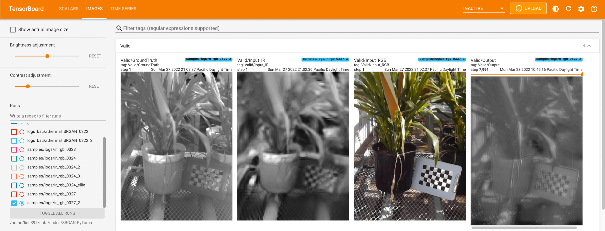

# SRGAN-PyTorch
Modified by Heesup Yun

Original Repo: https://github.com/Lornatang/SRGAN-PyTorch
## Overview
<span align="center"></span>


# Setup
```{bash}
conda install pytorch==1.13.1 torchvision==0.14.1 torchaudio==0.13.1 pytorch-cuda=11.6 -c pytorch -c nvidia
conda install tensorboard scipy matplotlib tqdm
pip install opencv-python
```